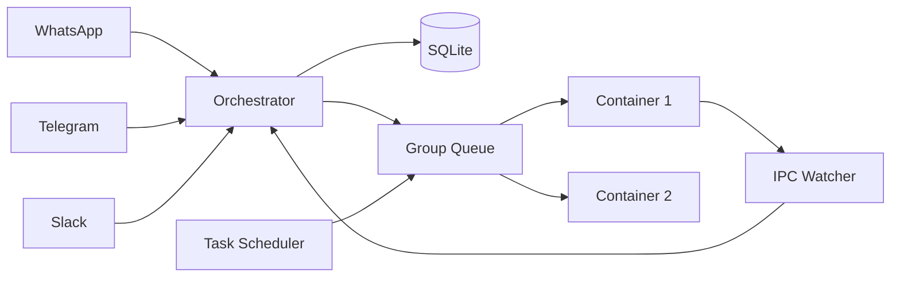

> **GitHub Repository**: [bahree/nanoclaw](https://github.com/bahree/nanoclaw) - full source code

---

[NanoClaw](https://github.com/qwibitai/nanoclaw) (formerly OpenClaw) is an open-source AI assistant that runs on your own server. It processes messages from WhatsApp, Telegram, and Slack, runs scheduled tasks, and manages conversations with Claude agents in isolated containers. I forked it a few weeks ago and it quickly became indispensable - handling everything from answering questions in family group chats, to tracking flights, to giving me a daily morning briefing with F1 standings and weather.

But running a headless service 24/7 on a personal server exposes gaps that the upstream project hadn't hit yet. Security issues I found while reading the code. Reliability bugs that only surface under real usage. Zero visibility into what the system was doing or why. And when my wife wanted her own assistant, no way to run a second instance.

This post covers 30 commits across five themes - everything I changed to go from "interesting fork" to "reliable family deployment." About ~2000 lines of new TypeScript, three new modules, four new SQLite tables, and a bunch of documentation.

## TL;DR

I forked NanoClaw and made it production-ready for my family. Five groups of changes:

1. **Security hardening** - the `.env` file (with API keys) was mounted into containers, IPC had no isolation between groups, and message content was logged at info level. Fixed all three.
2. **Reliability fixes** - messages were being silently lost during container failures, cursor advancement bugs caused duplicate processing, and the `@Claw` trigger only worked at the start of a message. Four fixes total.
3. **Observability** - `/status` for real-time visibility, `/debug` for event tracing, `/usage` for API cost tracking. Eleven features, zero SSH. Four SQLite tables, three new modules.
4. **Multi-user deployment** - second instance for my wife with her own WhatsApp, isolated groups and memory. Setup guide, restart-all script, group registration docs.
5. **Operational improvements** - weekly upstream update checker with WhatsApp notification, Telegram removal (not used), ESLint, Slack formatting skill.

All changes are backwards-compatible with upstream and contributed back as skill branches where applicable.

## 1. The architecture (quick context)

> This section provides context for readers unfamiliar with NanoClaw. Skip to section 2 if you already know the architecture.

Before diving in, here's how NanoClaw works at a high level. Understanding this makes the instrumentation decisions clearer. NanoClaw is a OSS fork of OpenClaw, so it shares the same core architecture:



Messages arrive from channels, get stored in SQLite, and the orchestrator polls for new messages every 2 seconds. When a registered group has unprocessed messages, the group queue spawns a container running Claude's Agent SDK. The agent's output streams back through the orchestrator to the originating channel. Scheduled tasks follow the same path but are triggered by a cron/interval scheduler rather than by incoming messages.

The key insight: everything flows through the orchestrator. That's where we intercept commands, instrument actions, and expose state. The group queue manages the container lifecycle. The database is already there for message storage. All the pieces are in place - we just need to wire them up.

## 2. Security hardening

The first thing I did after forking was read the code. Three issues jumped out immediately.

### 2.1 API keys leaked to every container

The container runner mounted the entire `.env` file into agent containers. This meant every container - even those running on behalf of other group members - had access to every secret: Anthropic API key, OpenAI key, Gmail OAuth tokens, everything.

The fix was to mount `/dev/null` over `.env` inside the container and instead expose only the specific variables needed (like `ANTHROPIC_BASE_URL` pointing to the credential proxy). The credential proxy already existed for API key management - it just wasn't being used as the sole path.

```typescript {caption="Listing: Blocking .env access in containers" linenos=false}
// Before: full .env mounted into container
mounts.push({ hostPath: envFile, containerPath: '/workspace/project/.env', readonly: true });

// After: mount /dev/null to mask the .env, proxy handles auth
mounts.push({ hostPath: '/dev/null', containerPath: '/workspace/project/.env', readonly: true });
```

### 2.2 IPC had no group isolation

The IPC (inter-process communication) system let containers send messages and register groups via files in a shared directory. But there was no validation that a container could only write to its own namespace. A container running for "family-chat" could write an IPC message as if it came from "work-chat" and register new groups or send messages on behalf of other groups.

The fix was per-group IPC namespaces: each container gets its own IPC directory (`data/ipc/{group-folder}/`), and the IPC watcher validates that messages in a namespace can only affect that group. Cross-group operations (like `send_message` to a different group) are allowed only from the main group.

### 2.3 Message content in info-level logs

Pino was logging full message content at `info` level. Anyone with log access could read every message. Moved content to `debug` level and keep only metadata (sender, group, timestamp) at `info`.

These three changes were the first commits after forking. None of them are exotic - they're the kind of issues you find when you actually read the code with a security mindset, knowing it's going to run on your home server handling your family's messages.

## 3. Reliability fixes

Once I started using NanoClaw daily, four bugs surfaced that only appear under real load.

#### 4.1.1 Silent message loss on container failure

When `processGroupMessages` threw an exception, the message cursor had already been advanced. The messages were marked as "processed" but the container never actually handled them. They just disappeared.

The fix was to save the old cursor, advance optimistically, and roll back on error:

```typescript {caption="Listing: Cursor rollback on container failure" linenos=false}
const previousCursor = lastAgentTimestamp[chatJid] || '';
lastAgentTimestamp[chatJid] = missedMessages[missedMessages.length - 1].timestamp;
saveState();

try {
  await runContainerAgent(group, input, ...);
} catch (err) {
  // Roll back cursor so messages are re-processed on next cycle
  lastAgentTimestamp[chatJid] = previousCursor;
  saveState();
  throw err;
}
```

### 3.2 Cursor advancement on pipe-to-active container

When a new message arrived for a group that already had an active container, NanoClaw piped the message to the running container via IPC. But it also advanced the cursor. If the container died before processing the piped message, that message was lost too. Fixed by only advancing the cursor when `processGroupMessages` actually starts processing, not on pipe.

### 3.3 lastAgentTimestamp updated on failure

The agent timestamp was being updated even when the agent returned an error. This meant failed invocations still advanced the cursor, potentially skipping messages. Fixed to only update on success.

### 3.4 @Claw trigger only worked at start of message

The trigger pattern was `^@Claw\b` - anchored to the start of the message. So "Hey @Claw what's the weather?" was silently ignored while "@Claw what's the weather?" worked. Confusing for users in group chats where people naturally write "Hey @Claw..." or "Can you check @Claw...".

Removed the `^` anchor. The pattern is now `@Claw\b` (case-insensitive), matching anywhere in the message.

## 4. Observability

This is the biggest chunk of work. The problem: when something goes wrong with a headless service, the only way to investigate is SSH. I wanted to ask the system "what are you doing?" and "why did you do that?" from the same WhatsApp chat I use to talk to it.

### What was built

Three new modules, eight modified files, eleven distinct features:

| # | Feature | Type | Files |
|---|---------|------|-------|
| 1 | `/status` - system dashboard | Command | `status.ts`, `index.ts` |
| 2 | `/status tasks` - task detail view | Command | `status.ts`, `index.ts` |
| 3 | `/task pause\|resume\|delete` - task management | Command | `status.ts`, `index.ts` |
| 4 | `GroupQueue.getStatus()` - queue introspection | API | `group-queue.ts` |
| 5 | Three-table event log schema | Schema | `db.ts` |
| 6 | `logEvent` / `logAction` / `logToolCall` | Module | `event-log.ts` (new) |
| 7 | Pipeline instrumentation | Instrumentation | `index.ts`, `task-scheduler.ts`, `ipc.ts` |
| 8 | `/debug last\|why\|event\|report` | Command | `status.ts`, `event-log.ts` |
| 9 | Auto-pruning with configurable retention | Config | `event-log.ts`, `config.ts` |
| 10 | Usage log schema + per-invocation tracking | Schema + Module | `usage-log.ts` (new), `container-runner.ts` |
| 11 | `/usage` - API cost and token tracking | Command | `status.ts`, `commands.ts`, `agent-runner` |

All commands are restricted to the **main group** only. Non-main groups are silently ignored, preventing random group members from querying system status or managing tasks.

### 4.1 /status - real-time system dashboard

The `/status` command assembles information from several subsystems into a single message. It queries the group queue for container states, the database for registered groups and tasks, and formats it all as a WhatsApp-friendly message.

The output is designed to give a quick overview of the system's health and activity at a glance:

<figure id="fig2">

<figcaption><strong>Figure 2:</strong> /status while the agent is answering an F1 question - containers, channels, groups, and tasks at a glance.</figcaption>
</figure>

What it shows:
- **Uptime and memory** - how long the process has been running, RSS in MB
- **Timezone** - the configured timezone (important for cron schedules)
- **Containers** - active/max concurrent, with per-group detail (idle, processing, running task, queued)
- **Channels** - which messaging channels are connected (WhatsApp, Telegram, etc.)
- **Groups** - all registered groups with the main group indicator
- **Tasks** - count of active/paused tasks, next upcoming task with time-until
- **Remote control** - whether a remote Claude Code session is active

The implementation pulls from existing subsystems - no new state tracking was needed:

```typescript {caption="Listing 1: Building the status response" id="listing1" linenos=false}
export function buildStatus(queue: GroupQueue, channels: Channel[]): string {
  const uptime = formatDuration(Date.now() - startTime);
  const mem = Math.round(process.memoryUsage.rss() / 1024 / 1024);

  const qs = queue.getStatus();       // new method on GroupQueue
  const channelNames = channels.map((ch) => ch.name).join(', ');
  const groups = getAllRegisteredGroups();
  const tasks = getAllTasks();
  const activeTasks = tasks.filter((t) => t.status === 'active');
  const rc = getActiveSession();       // remote control state

  const lines: string[] = [
    `*${ASSISTANT_NAME} Status*`,
    `----------------`,
    `Uptime: ${uptime}`,
    `Memory: ${mem} MB`,
    `Timezone: ${TIMEZONE}`,
    ``,
    `*Containers:* ${qs.activeCount}/${qs.maxConcurrent} active`,
    `*Channels:* ${channelNames || 'none'}`,
  ];
  // ... active container details, groups, tasks, remote control
  return lines.join('\n');
}
```

#### 4.1.1 Exposing queue internals

The `GroupQueue` class already tracked everything we needed internally: active containers, pending messages, pending tasks, and idle state. It just wasn't exposed. A new `getStatus()` method surfaces this without leaking internal implementation:

```typescript {caption="Listing 2: GroupQueue.getStatus() - queue introspection" id="listing2" linenos=false}
getStatus(): {
  activeCount: number;
  maxConcurrent: number;
  waitingCount: number;
  groups: Array<{
    jid: string;
    active: boolean;
    idleWaiting: boolean;
    isTaskContainer: boolean;
    pendingMessages: boolean;
    pendingTaskCount: number;
  }>;
} {
  const groups = [];
  for (const [jid, state] of this.groups) {
    if (state.active || state.pendingMessages || state.pendingTasks.length > 0) {
      groups.push({
        jid,
        active: state.active,
        idleWaiting: state.idleWaiting,
        isTaskContainer: state.isTaskContainer,
        pendingMessages: state.pendingMessages,
        pendingTaskCount: state.pendingTasks.length,
      });
    }
  }
  return {
    activeCount: this.activeCount,
    maxConcurrent: MAX_CONCURRENT_CONTAINERS,
    waitingCount: this.waitingGroups.length,
    groups,
  };
}
```

Only groups with activity (active, pending messages, or pending tasks) are included - no noise from idle groups. The status output translates these states into human-readable labels: "idle", "processing", "running task", or "queued".

### 4.2 /status tasks - task detail view

While `/status` includes a task summary (count + next upcoming), `/status tasks` gives the full picture. Each task shows its prompt (truncated to 50 chars), schedule type, next run time, last run time, and the task ID you need for management commands.

<figure id="fig3">

<figcaption><strong>Figure 3:</strong> /status tasks - two active daily crons (morning briefing with F1 + weather, AI news digest) and completed one-offs (flight tracking, reminders).</figcaption>
</figure>

```typescript {caption="Listing 3: Formatting a task line" id="listing3" linenos=false}
function formatTaskLine(task: ScheduledTask, index: number): string {
  const status = task.status === 'active' ? ''
    : task.status === 'paused' ? ' [paused]' : ' [done]';
  const schedule = task.schedule_type === 'cron'
    ? `cron: ${task.schedule_value}`
    : task.schedule_type === 'interval'
      ? `every ${task.schedule_value}`
      : `once`;
  const prompt = task.prompt.length > 50
    ? task.prompt.slice(0, 50) + '...' : task.prompt;
  const next = task.next_run ? formatTimeUntil(task.next_run) : 'n/a';
  const lastRun = task.last_run ? formatTimeAgo(task.last_run) : 'never';

  return [
    `*${index + 1}.* ${prompt}${status}`,
    `   Schedule: ${schedule}`,
    `   Next: ${next} | Last: ${lastRun}`,
    `   ID: ${task.id}`,
  ].join('\n');
}
```

Tasks are grouped by status - active first, then paused, then completed. The relative time formatting (`in 2h 15m`, `3m 42s ago`) makes it easy to see at a glance what's coming up and what ran recently.

### 4.3 /task - operational control

The `/task` command turns the chat into a control plane. No more SSH-ing in to pause a runaway task or clean up a completed one.

| Command | What it does |
|---------|-------------|
| `/task pause <id>` | Pause an active task (stops scheduling, preserves config) |
| `/task resume <id>` | Resume a paused task |
| `/task delete <id>` | Delete a task and its run history |

<figure id="fig4">

<figcaption><strong>Figure 4:</strong> Pausing and resuming the AI news digest task - no SSH, no restart.</figcaption>
</figure>

```typescript {caption="Listing 4: Task command handler" id="listing4" linenos=false}
export function handleTaskCommand(
  args: string,
): { ok: true; message: string } | { ok: false; error: string } {
  const parts = args.trim().split(/\s+/);
  const action = parts[0]?.toLowerCase();
  const taskId = parts.slice(1).join(' ');

  const task = getTaskById(taskId);
  if (!task) return { ok: false, error: `Task not found: ${taskId}` };

  switch (action) {
    case 'pause':
      if (task.status !== 'active')
        return { ok: false, error: `Task is already ${task.status}` };
      updateTask(taskId, { status: 'paused' });
      return { ok: true, message: `Paused: "${task.prompt.slice(0, 50)}"` };
    case 'resume':
      if (task.status !== 'paused')
        return { ok: false, error: `Task is ${task.status}, not paused` };
      updateTask(taskId, { status: 'active' });
      return { ok: true, message: `Resumed: "${task.prompt.slice(0, 50)}"` };
    case 'delete':
      deleteTask(taskId);
      return { ok: true, message: `Deleted: "${task.prompt.slice(0, 50)}"` };
    default:
      return { ok: false, error: `Unknown action: ${action}` };
  }
}
```

The result type (`{ ok: true; message } | { ok: false; error }`) is a pattern used throughout NanoClaw for commands; the caller doesn't need to know the implementation details, just whether it succeeded and what to tell the user. State validation is done upfront (can't pause an already-paused task, can't resume an active one).

### 4.4 Command interception

All built-in commands (`/status`, `/status tasks`, `/task`, `/debug`) share the same interception pattern: they're caught at the top of the `onMessage` callback, **before** the message is stored or processed.

```typescript {caption="Listing 5: Intercepting built-in commands before storage" id="listing5" linenos=false}
const channelOpts = {
  onMessage: (chatJid: string, msg: NewMessage) => {
    const trimmed = msg.content.trim();

    // Built-in commands - intercept before storage
    if (trimmed === '/status' || trimmed === '/status tasks') {
      handleStatus(trimmed, chatJid, msg).catch(/* ... */);
      return;  // don't store, don't process
    }
    if (trimmed.startsWith('/task ')) {
      handleTaskCmd(chatJid, msg).catch(/* ... */);
      return;
    }
    if (trimmed.startsWith('/debug')) {
      handleDebugCmd(chatJid, msg).catch(/* ... */);
      return;
    }

    // ... sender allowlist filtering, event logging, message storage
    storeMessage(msg);
  },
};
```

The `return` before `storeMessage()` is the key design decision. These commands are ephemeral -- they shouldn't appear in the conversation history, shouldn't trigger the agent, and shouldn't affect message cursors. They're handled entirely by the host process and respond instantly (no container spawn needed).

Each handler checks `group?.isMain` before proceeding. Non-main-group commands are silently dropped, with a warning in the server logs.

### 4.5 Event/action/tool logging

The commands above tell you what's happening *now*. But when something went wrong an hour ago, you need a trail. That's where event logging comes in.

#### 4.5.1 The three-table schema

NanoClaw's existing SQLite schema was focused on message storage and container state. We needed a new schema to capture the full traceability from inbound triggers to outbound actions to tool calls. The design is a simple three-table structure. Every inbound trigger is an **event**, every outbound action is an **action** linked to its triggering event, and every tool invocation is a **tool call** linked to its parent action.

```sql {caption="Listing 6: Event logging schema" id="listing6" linenos=false}
CREATE TABLE IF NOT EXISTS event_log (
  id           TEXT PRIMARY KEY,    -- UUID
  timestamp    DATETIME DEFAULT CURRENT_TIMESTAMP,
  source       TEXT NOT NULL,       -- 'whatsapp', 'telegram', 'scheduled_task', 'ipc'
  source_id    TEXT,                -- message ID, task ID, etc.
  raw_content  TEXT,                -- full payload (JSON, truncated to 10KB)
  summary      TEXT                 -- human-readable one-liner
);

CREATE TABLE IF NOT EXISTS action_log (
  id            TEXT PRIMARY KEY,
  timestamp     DATETIME DEFAULT CURRENT_TIMESTAMP,
  triggered_by  TEXT REFERENCES event_log(id),
  action_type   TEXT NOT NULL,      -- 'message_sent', 'task_scheduled', 'tool_call'
  target        TEXT,               -- group JID, email address, task ID
  content       TEXT,               -- what was sent or done
  tool_calls    TEXT                -- JSON array of tool names
);

CREATE TABLE IF NOT EXISTS tool_call_log (
  id           TEXT PRIMARY KEY,
  action_id    TEXT REFERENCES action_log(id),
  timestamp    DATETIME DEFAULT CURRENT_TIMESTAMP,
  tool_name    TEXT NOT NULL,
  input        TEXT,                -- JSON (truncated to 10KB)
  output       TEXT,                -- JSON (truncated to 10KB)
  duration_ms  INTEGER,
  success      INTEGER DEFAULT 1
);

CREATE INDEX IF NOT EXISTS idx_event_log_timestamp ON event_log(timestamp);
CREATE INDEX IF NOT EXISTS idx_action_log_triggered_by ON action_log(triggered_by);
CREATE INDEX IF NOT EXISTS idx_tool_call_log_action_id ON tool_call_log(action_id);
```

The foreign key chain is `event_log` <- `action_log` <- `tool_call_log`. Given any action, you can trace back to *why* it happened. Given any event, you can see *everything* it caused. The indexes support the `/debug` query patterns: filtering by timestamp (pruning), joining by `triggered_by` (event lookups), and grouping by `action_id` (tool call chains).

```mermaid {caption="Figure 5: Event -> Action -> Tool Call tracing chain" id="fig5"}
flowchart TD
    E[Event: WhatsApp message received] --> A1[Action: message_sent to group]
    E --> A2[Action: task_scheduled]
    A1 --> T1[Tool Call: runContainerAgent]
    A1 --> T2[Tool Call: channel.sendMessage]
```

These tables live in the same `messages.db` file as everything else. No additional file handles, no additional backup concerns, no additional connection management. They're created in the existing `createSchema()` function using `CREATE TABLE IF NOT EXISTS`, so they're added transparently on first startup after the upgrade.

#### 4.5.2 The logger module

Three functions, matching the three tables. All IDs are UUIDs via `crypto.randomUUID()`. All writes are fire-and-forget - wrapped in `try/catch`, errors logged at `debug` level, never blocking the pipeline.

```typescript {caption="Listing 7: Core logging functions" id="listing7" linenos=false}
export function logEvent(
  source: string,
  sourceId: string | null,
  rawContent: unknown,
  summary: string,
): string {
  const id = crypto.randomUUID();
  try {
    insertEventStmt().run(
      id, new Date().toISOString(), source, sourceId,
      truncate(rawContent), summary,
    );
  } catch (err) {
    logger.debug({ err, source, sourceId }, 'Failed to log event');
  }
  return id;  // always returns an ID, even if the write failed
}

export function logAction(
  triggeredBy: string | null,
  actionType: string,
  target: string | null,
  content: unknown,
  toolCalls?: string[],
): string {
  const id = crypto.randomUUID();
  try {
    insertActionStmt().run(
      id, new Date().toISOString(), triggeredBy, actionType,
      target, truncate(content),
      toolCalls ? JSON.stringify(toolCalls) : null,
    );
  } catch (err) {
    logger.debug({ err, actionType, target }, 'Failed to log action');
  }
  return id;
}
```

Every call returns an ID, so callers can chain events -> actions -> tool calls, even if the write fails silently. This is intentional - the pipeline code doesn't check whether logging succeeded, it just carries the ID forward.

The `truncate()` helper caps content at 10KB to prevent DB bloat:

```typescript {caption="Listing 8: Content truncation" id="listing8" linenos=false}
const MAX_CONTENT_SIZE = 10 * 1024;

function truncate(value: unknown): string | null {
  if (value === undefined || value === null) return null;
  const str = typeof value === 'string' ? value : JSON.stringify(value);
  if (str.length > MAX_CONTENT_SIZE) return str.slice(0, MAX_CONTENT_SIZE);
  return str;
}
```

#### 4.5.3 The tool call wrapper

`logToolCall` is different from the other two - it wraps an async operation and automatically records input, output, duration, and success/failure:

```typescript {caption="Listing 9: Tool call wrapper with automatic instrumentation" id="listing9" linenos=false}
export async function logToolCall<T>(
  actionId: string,
  toolName: string,
  input: unknown,
  fn: () => Promise<T>,
): Promise<T> {
  const id = crypto.randomUUID();
  const start = Date.now();
  let success = true;
  let output: unknown = null;

  try {
    const result = await fn();
    output = result;
    return result;
  } catch (err) {
    success = false;
    output = err instanceof Error ? err.message : String(err);
    throw err;  // re-throw - logging doesn't swallow errors
  } finally {
    const durationMs = Date.now() - start;
    try {
      insertToolCallStmt().run(
        id, actionId, new Date().toISOString(), toolName,
        truncate(input), truncate(output), durationMs, success ? 1 : 0,
      );
    } catch (logErr) {
      logger.debug({ err: logErr, toolName }, 'Failed to log tool call');
    }
  }
}
```

The `finally` block ensures the log entry is written regardless of whether the wrapped operation succeeded or failed. The error is always re-thrown - `logToolCall` is transparent to the caller. It's a decorator pattern: wrap any async operation and get free instrumentation.

Insert statements are lazily prepared and reused across calls, avoiding the overhead of re-preparing the same SQL on every log write.

#### 4.5.4 Instrumenting the pipeline

With the logger module in place, instrumentation is surgical - a few lines at each key point in the message flow:

**Inbound messages** (in the `onMessage` callback):

```typescript {caption="Listing 10: Logging inbound messages with channel detection" id="listing10" linenos=false}
// Detect channel from JID format
const evtChannel = chatJid.includes('@g.us') || chatJid.includes('@s.whatsapp.net')
  ? 'whatsapp'
  : chatJid.startsWith('tg:') ? 'telegram'
  : chatJid.startsWith('dc:') ? 'discord'
  : chatJid.startsWith('sl:') ? 'slack'
  : 'channel';

logEvent(
  evtChannel, msg.id,
  { sender: msg.sender_name, content: msg.content?.slice(0, 200) },
  `Message from ${msg.sender_name}: ${(msg.content || '').slice(0, 80)}`,
);
```

**Agent processing** (when the orchestrator starts handling a group's messages):

```typescript {caption="Listing 11: Logging the processing event and carrying the eventId" id="listing11" linenos=false}
// Log the processing event - this ID links to all downstream actions
const eventId = logEvent(
  'message_batch', chatJid,
  { messageCount: missedMessages.length, group: group.name },
  `Processing ${missedMessages.length} message(s) for ${group.name}`,
);
```

**Outbound messages** (in the streaming output callback):

```typescript {caption="Listing 12: Logging outbound actions linked to the triggering event" id="listing12" linenos=false}
if (text) {
  await channel.sendMessage(chatJid, text);
  logAction(eventId, 'message_sent', chatJid, text.slice(0, 500));
}
```

The `eventId` from the processing event links the outbound action back to the batch that triggered it. This is the chain that `/debug why` follows.

**Scheduled tasks** - logged at the point the scheduler picks up a due task, and again when the result is sent to the user:

```typescript {caption="Listing 13: Scheduled task instrumentation" id="listing13" linenos=false}
const eventId = logEvent(
  'scheduled_task', task.id,
  { prompt: task.prompt.slice(0, 200), schedule: task.schedule_type },
  `Scheduled task: ${task.prompt.slice(0, 80)}`,
);

// ... later, when the container produces output:
await deps.sendMessage(task.chat_jid, streamedOutput.result);
logAction(eventId, 'message_sent', task.chat_jid, result?.slice(0, 500) ?? null);
```

**IPC** - logged when the IPC watcher processes messages and task operations from containers:

```typescript {caption="Listing 14: IPC message instrumentation" id="listing14" linenos=false}
const ipcEventId = logEvent(
  'ipc', null,
  { chatJid: data.chatJid, sourceGroup, text: data.text?.slice(0, 200) },
  `IPC message from ${sourceGroup}`,
);
await deps.sendMessage(data.chatJid, data.text);
logAction(ipcEventId, 'message_sent', data.chatJid, data.text?.slice(0, 500) ?? null);
```

### 4.6 The /debug commands

Four subcommands for querying the event log, all main-group only:

| Command | What it shows |
|---------|--------------|
| `/debug last <n>` | Last *n* actions with their triggering events |
| `/debug why` | Most recent action with full event context and tool call chain |
| `/debug event <id>` | Everything triggered by a specific event |
| `/debug report` | Summary dashboard: table sizes, events by source, actions by type, busiest hours, recent errors |

#### 4.6.1 /debug last - quick scan

The "what happened recently?" view. Joins `action_log` with `event_log` to show each action alongside what caused it:

<figure id="fig6">

<figcaption><strong>Figure 6:</strong> /debug last 5 - the F1 response, flight landing alert, and Gmail cleanup, each traced back to its trigger.</figcaption>
</figure>

```typescript {caption="Listing 15: Querying last N actions with LEFT JOIN" id="listing15" linenos=false}
export function getLastActions(n: number): Array<{
  action: ActionLogRow;
  event: EventLogRow | null;
}> {
  const rows = getDb()
    .prepare(
      `SELECT a.*, e.id as e_id, e.timestamp as e_timestamp,
              e.source as e_source, e.source_id as e_source_id,
              e.summary as e_summary
       FROM action_log a
       LEFT JOIN event_log e ON a.triggered_by = e.id
       ORDER BY a.timestamp DESC
       LIMIT ?`,
    )
    .all(n);
  // ... map to structured result
}
```

The `LEFT JOIN` is important - some actions might not have a triggering event (e.g., system-initiated actions), and we still want to see them.

#### 4.6.2 /debug why - full trace

Answers "why did the last thing happen?" by pulling the most recent action, its triggering event, and all associated tool calls:

<figure id="fig7">

<figcaption><strong>Figure 7:</strong> /debug why - tracing the most recent action back to the WhatsApp message that caused it.</figcaption>
</figure>

```typescript {caption="Listing 16: Full trace for the most recent action" id="listing16" linenos=false}
export function getLastActionWithToolCalls(): {
  action: ActionLogRow;
  event: EventLogRow | null;
  toolCalls: ToolCallLogRow[];
} | null {
  const results = getLastActions(1);
  if (results.length === 0) return null;

  const { action, event } = results[0];
  const toolCalls = getDb()
    .prepare(
      `SELECT * FROM tool_call_log WHERE action_id = ? ORDER BY timestamp`,
    )
    .all(action.id) as ToolCallLogRow[];

  return { action, event, toolCalls };
}
```

The output shows the full chain: triggering event (source, summary, timestamp, ID), the action taken (type, target, content), and each tool call with its duration and success/failure status. Copy the event ID from here and use `/debug event <id>` to see everything else that event triggered.

#### 4.6.3 /debug report - summary dashboard

The "is everything healthy?" view. Aggregates across all three tables into a single report:

<figure id="fig8">

<figcaption><strong>Figure 8:</strong> /debug report - a day's worth of WhatsApp messages, flight tracking, Gmail cleanup, and F1 queries summarized.</figcaption>
</figure>

What it includes:
- **Retention period** - configured days and current time window
- **Table sizes** - row counts for events, actions, and tool calls
- **Events by source** - breakdown by channel (whatsapp, telegram, scheduled_task, ipc)
- **Actions by type** - breakdown by what was done (message_sent, task_scheduled, etc.)
- **Busiest hours** - top 5 hours by event count, in local timezone
- **Recent failed tool calls** - last 10 with tool name, duration, and error output
- **Recent errors** - last 10 error-like actions with their triggering event

One thing worth noting: the busiest hours are computed in JavaScript using `toLocaleString` with the configured time zone, not in SQL. SQLite stores timestamps as UTC (as ISO strings), and performing timezone conversions in SQL would require loading an extension. Instead, we fetch the raw timestamps and bucket them in JS:

```typescript {caption="Listing 17: Bucketing event timestamps by local hour" id="listing17" linenos=false}
const allTimestamps = db.prepare(`SELECT timestamp FROM event_log`).all();
const hourCounts = new Map<string, number>();
for (const { timestamp } of allTimestamps) {
  const localHour = new Date(timestamp).toLocaleString('en-US', {
    timeZone: TIMEZONE,
    hour: 'numeric', hour12: true,
  });
  hourCounts.set(localHour, (hourCounts.get(localHour) || 0) + 1);
}
```

Learned this the hard way when the report initially showed UTC hours, and I couldn't figure out why 5 PM was my busiest time. 😄

### 4.7 Auto-pruning and retention

An unbounded observability system is a liability. Logs older than 3 days are automatically deleted. The retention period is configurable via the `EVENT_LOG_RETENTION_DAYS` environment variable (set to 0 to disable pruning).

```typescript {caption="Listing 18: Log retention configuration" id="listing18" linenos=false}
// config.ts
export const EVENT_LOG_RETENTION_DAYS = Math.max(
  0,
  parseInt(process.env.EVENT_LOG_RETENTION_DAYS || '3', 10) || 3,
);
export const EVENT_LOG_PRUNE_INTERVAL = 60 * 60 * 1000; // hourly
```

Pruning runs at startup (clean up anything that expired while the service was down) and then every 60 minutes:

```typescript {caption="Listing 19: Pruning with FK-safe deletion order" id="listing19" linenos=false}
export function pruneOldLogs() {
  if (EVENT_LOG_RETENTION_DAYS === 0) return;

  const cutoff = new Date(
    Date.now() - EVENT_LOG_RETENTION_DAYS * 24 * 60 * 60 * 1000,
  ).toISOString();

  const db = getDb();
  // Delete in FK-safe order: children first
  db.prepare(`DELETE FROM tool_call_log WHERE action_id IN (
    SELECT id FROM action_log WHERE timestamp < ?
  )`).run(cutoff);
  db.prepare(`DELETE FROM action_log WHERE timestamp < ?`).run(cutoff);
  db.prepare(`DELETE FROM event_log WHERE timestamp < ?`).run(cutoff);
}

export function startLogPruning(): void {
  pruneOldLogs();
  const timer = setInterval(pruneOldLogs, EVENT_LOG_PRUNE_INTERVAL);
  timer.unref();   // don't keep the process alive for pruning
}
```

The deletion order matters: `tool_call_log` rows reference `action_log`, which in turn references `event_log`. Deleting parents first would violate foreign key constraints. The `timer.unref()` call ensures the pruning interval doesn't prevent graceful shutdown.

### 4.8 Design decisions

A few choices that are worth calling out:

**Fire-and-forget, not await.** Every logging call is synchronous (better-sqlite3) and wrapped in `try/catch`. If the write fails - disk full, DB locked, schema mismatch - the error is logged at `debug` level and the pipeline continues. The logging system is never on the critical path. An observability system that can take down the thing it's observing is worse than useless.

**Same database, no new dependencies.** The logging tables live in `messages.db` alongside messages, tasks, sessions, and router state. No new files to back up, no new connections to manage, no new packages to install. `CREATE TABLE IF NOT EXISTS` means existing installations pick up the schema on restart.

**Commands intercepted before storage.** `/status`, `/task`, and `/debug` messages never reach the agent container. They don't appear in conversation history, don't trigger container spawns, and don't affect message cursors. This is important - a `/status` check shouldn't cost you a container slot or show up as context in the agent's next conversation.

**Prepared statements, lazily created.** The insert statements are created on first use and reused across calls. For a system logging every message and action, re-preparing SQL on every call would add up.

**UUIDs for everything.** `crypto.randomUUID()` for all IDs. No auto-increment, no collision risk across restarts, and IDs are meaningful in isolation (you can paste one into `/debug event <id>` without context).

### 4.9 /usage - API usage and cost tracking

The observability features above tell you *what* the system is doing. But there's another question: *how much is it costing?* Each agent invocation calls the Claude API, consuming tokens and incurring costs. With multiple groups, scheduled tasks, and ad-hoc queries, usage adds up - and without tracking, you're flying blind until the invoice arrives.

#### 4.9.1 The data was already there

The Claude Agent SDK returns rich usage data on every result message: `input_tokens`, `output_tokens`, cache statistics (`cache_read_input_tokens`, `cache_creation_input_tokens`), `total_cost_usd`, `duration_ms`, and `num_turns`. NanoClaw's agent-runner was simply ignoring all of it - extracting only the text result and discarding the rest.

The fix was surgical. In the agent-runner (inside the container), extract the usage fields from the SDK result:

```typescript {caption="Listing 20: Extracting usage data from SDK result messages" id="listing20" linenos=false}
if (message.type === 'result') {
  const rm = message as Record<string, unknown>;
  const usageObj = rm.usage as Record<string, number> | undefined;
  const usage = usageObj ? {
    input_tokens: usageObj.input_tokens || 0,
    output_tokens: usageObj.output_tokens || 0,
    cache_read_input_tokens: usageObj.cache_read_input_tokens || 0,
    cache_creation_input_tokens: usageObj.cache_creation_input_tokens || 0,
    cost_usd: typeof rm.total_cost_usd === 'number' ? rm.total_cost_usd : 0,
    duration_ms: typeof rm.duration_ms === 'number' ? rm.duration_ms : 0,
    num_turns: typeof rm.num_turns === 'number' ? rm.num_turns : 0,
  } : undefined;

  writeOutput({ status: 'success', result: textResult, newSessionId, usage });
}
```

The `usage` field is optional on `ContainerOutput`, so old containers without the change simply don't emit it - no breaking change, no migration.

#### 4.9.2 Storage

Following the same pattern as event logging: a self-contained module (`usage-log.ts`) with its own table, lazy schema initialization, and fire-and-forget writes.

```sql {caption="Listing 21: Usage log schema" id="listing21" linenos=false}
CREATE TABLE IF NOT EXISTS usage_log (
  id                    TEXT PRIMARY KEY,
  timestamp             DATETIME DEFAULT CURRENT_TIMESTAMP,
  group_jid             TEXT NOT NULL,
  group_name            TEXT NOT NULL,
  group_folder          TEXT NOT NULL,
  input_tokens          INTEGER NOT NULL DEFAULT 0,
  output_tokens         INTEGER NOT NULL DEFAULT 0,
  cache_read_tokens     INTEGER NOT NULL DEFAULT 0,
  cache_creation_tokens INTEGER NOT NULL DEFAULT 0,
  cost_usd              REAL NOT NULL DEFAULT 0,
  duration_ms           INTEGER NOT NULL DEFAULT 0,
  num_turns             INTEGER NOT NULL DEFAULT 0
);
```

One row per agent invocation. The `group_jid` and `group_folder` columns enable per-group breakdowns. Indexes on `timestamp` and `group_jid` support the query patterns used by the `/usage` command.

The integration point is a single line in the `wrappedOnOutput` callback:

```typescript {caption="Listing 22: Logging usage in the output callback" id="listing22" linenos=false}
if (output.usage) {
  logUsage(chatJid, group.name, group.folder, output.usage);
}
```

#### 4.9.3 The /usage command

Same pattern as `/status` and `/debug` - intercepted before storage, main-group only, responds instantly.

| Command | What it shows |
|---------|--------------|
| `/usage` | Today's summary + per-group breakdown + 7-day daily trend |
| `/usage week` | Last 7 days aggregated |
| `/usage month` | Last 30 days aggregated |
| `/usage all` | All time totals |
| `/usage help` | Available options |

The output includes:
- **Invocation count** - how many times the agent was called
- **Token breakdown** - input/output tokens with human-readable formatting (1.2K, 3.5M)
- **Cache efficiency** - read vs. creation tokens (high read ratio = good cache hits)
- **Cost** - total USD for the period
- **Duration** - wall-clock time spent in agent containers
- **Per-group breakdown** - which groups are consuming the most tokens and cost
- **Daily trend** - (default view only) last 7 days to spot usage patterns

```typescript {caption="Listing 23: Usage summary query" id="listing23" linenos=false}
export function getUsageSummary(
  period: 'today' | 'week' | 'month' | 'all' = 'today',
): UsageSummary {
  const filter = periodFilter(period);
  return getDb()
    .prepare(
      `SELECT
         COUNT(*) as invocations,
         COALESCE(SUM(input_tokens), 0) as input_tokens,
         COALESCE(SUM(output_tokens), 0) as output_tokens,
         COALESCE(SUM(cost_usd), 0) as total_cost_usd,
         COALESCE(SUM(duration_ms), 0) as total_duration_ms
       FROM usage_log ${filter}`,
    )
    .get();
}
```

The period filter uses SQLite's `datetime()` function for time math:

```typescript {caption="Listing 24: Period filtering" id="listing24" linenos=false}
function periodFilter(period: 'today' | 'week' | 'month' | 'all'): string {
  switch (period) {
    case 'today':  return "WHERE timestamp >= datetime('now', 'start of day')";
    case 'week':   return "WHERE timestamp >= datetime('now', '-7 days')";
    case 'month':  return "WHERE timestamp >= datetime('now', '-30 days')";
    case 'all':    return '';
  }
}
```

No retention/pruning is implemented yet for usage data - the rows are small (one per invocation) and the data has long-term value for trend analysis. This may change as usage grows.

## 5. Multi-user deployment

My wife wanted her own assistant. NanoClaw links to one WhatsApp account per instance, so a second user needs a second instance. I needed to figure out how to run multiple instances on the same machine without them stepping on each other.

### 5.1 Architecture

Each instance is fully independent: separate git clone, separate SQLite database, separate WhatsApp auth, separate group folders. They share the Docker daemon and the container image, and can share the same Anthropic API key.

The key constraint is the credential proxy port. Each instance runs its own proxy that containers use to access the API key without having it in their environment. Two instances on the same port will fail to start. The `.env` file gets a unique `CREDENTIAL_PROXY_PORT` per instance.

| Resource | Shared? |
|----------|---------|
| Docker daemon and image | Yes |
| Source code | No (separate clone) |
| WhatsApp auth | No (each instance links to a different phone) |
| SQLite database | No |
| API credentials | Same key, different proxy ports |

### 5.2 WhatsApp pairing over SSH

WhatsApp auth requires scanning a QR code or entering a pairing code. QR codes rendered in a terminal over SSH are notoriously unreliable - font size, character spacing, and terminal rendering all conspire against you. The pairing code method is far more reliable: the script outputs a numeric code, the user enters it on their phone.

```bash
npx tsx src/whatsapp-auth.ts --pairing-code
```

### 5.3 Group registration

Adding the bot to a WhatsApp group requires two steps: someone adds the bot's phone number to the group in WhatsApp, and then the group is registered in NanoClaw's database so it knows to respond there.

Groups are registered by inserting into the `registered_groups` table. Folder names follow a channel-prefixed convention (`whatsapp_family-chat`, `telegram_dev-team`) that matches what the agent uses when registering groups via IPC. Getting this naming wrong causes orphaned folders - I learned this the hard way.

### 5.4 Restart-all script

With multiple instances, pulling code changes and restarting each one individually is tedious. A `restart-all.sh` script iterates over an array of `path|service-name` pairs, pulls, builds, and restarts each instance in one pass.

### 5.5 Documentation

I wrote three docs that didn't exist upstream:
- **SETUP-NEW-MACHINE.md** - end-to-end guide for deploying to a fresh Linux server
- **MULTI-USER-SETUP.md** - running multiple instances, group registration, port allocation
- **restart-all.sh** - the script itself plus docs on adding new instances

These are essential if you ever need to move to a new machine or onboard another user. Without them, you'd be reverse-engineering the setup from the code.

## 6. Operational improvements

A few smaller changes that add up.

### 6.1 Weekly upstream update checker

NanoClaw is actively developed upstream. I don't want to check for updates manually. A systemd timer runs weekly, fetches upstream, and sends a WhatsApp notification if updates are available. No action needed if you're already current.

### 6.2 Channel cleanup

I removed the Telegram channel - I don't use it, and having unused channel code adds complexity. The skill system makes this safe: if I ever want Telegram back, I can re-apply the skill branch.

### 6.3 ESLint and formatting

Added ESLint with error-handling rules and consistent Prettier formatting. Not glamorous, but it catches real issues (unhandled promise rejections, missing error handling) and makes diffs cleaner.

## 7. Try it yourself

If you're running NanoClaw (or OpenClaw), these features are available out of the box. Here's how to get started:

**If you already have NanoClaw running:**

1. Pull the latest code and rebuild:
   ```bash
   git pull
   npm run build
   ```

2. Restart the service:
   ```bash
   # Linux (systemd)
   systemctl --user restart nanoclaw

   # macOS (launchd)
   launchctl kickstart -k gui/$(id -u)/com.nanoclaw
   ```

3. The new tables are created automatically on startup. No migration step needed.

4. Send `/status` in your main group to verify it's working.

**If you're starting fresh:**

1. Fork or clone [bahree/nanoclaw](https://github.com/bahree/nanoclaw) (or the upstream [OpenClaw](https://github.com/qwibitai/nanoclaw))
2. Follow the setup instructions in the README
3. Once connected to a channel, all commands are available immediately

**Command reference:**

| Command | What it does |
|---------|-------------|
| `/status` | System overview: uptime, memory, containers, channels, groups, tasks |
| `/status tasks` | Full task list with schedules, next run, last run, IDs |
| `/task pause <id>` | Pause a scheduled task |
| `/task resume <id>` | Resume a paused task |
| `/task delete <id>` | Delete a task and its run history |
| `/debug last <n>` | Last n actions with their triggering events |
| `/debug why` | Most recent action with full trace |
| `/debug event <id>` | All actions triggered by a specific event |
| `/debug report` | Summary dashboard with stats and errors |
| `/usage` | Today's token/cost summary + 7-day trend |
| `/usage week\|month\|all` | Usage for other time periods |
| `/usage help` | Available options |

**Configuration:**

| Env variable | Default | What it does |
|-------------|---------|-------------|
| `EVENT_LOG_RETENTION_DAYS` | `3` | Days to keep event logs (0 = keep forever) |

All commands are main-group only. They respond instantly (no container needed) and don't appear in the conversation history.

## 8. Summary

Thirty commits, five themes, one goal: make an open-source AI assistant reliable enough to run for my family.

**Security** came first - the .env leak, IPC isolation gap, and content logging issues were the kind of bugs that wouldn't matter for a demo but absolutely matter for a system handling real conversations. **Reliability** fixes addressed the silent message loss that only surfaces under real usage patterns. **Observability** turned a black box into something you can interrogate from your phone - `/status`, `/debug`, and `/usage` replace SSH for day-to-day operations. **Multi-user deployment** let my wife have her own assistant without any shared state. **Operational improvements** keep the system maintained with minimal effort.

About ~2000 lines of new TypeScript across 30 commits. Three new modules (`status.ts`, `event-log.ts`, `usage-log.ts`), four new SQLite tables, comprehensive documentation for new machine setup and multi-user deployment, and a weekly update checker that pings me on WhatsApp when upstream has changes.

The fork is public at [bahree/nanoclaw](https://github.com/bahree/nanoclaw). Usage tracking is available as a skill branch (`skill/usage-tracking`) for upstream contribution. All changes are backwards-compatible - pulling upstream updates has never broken anything.

---

*The source code for NanoClaw is available at [bahree/nanoclaw](https://github.com/bahree/nanoclaw). The upstream project is at [qwibitai/nanoclaw](https://github.com/qwibitai/nanoclaw).*
